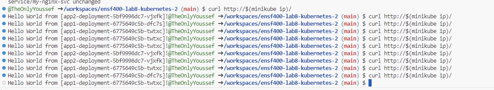

# ENSF 400 - Assignment 3 - Kubernetes Deployment Guide

This guide provides step-by-step instructions for deploying an Nginx service as a load balancer and two backend applications within a Minikube environment.

## Prerequisites

Before you begin, ensure you have the following installed:

- Minikube
- kubectl

## Deployment Process

### Step 1: Start Minikube

Start your Minikube cluster:

```sh
minikube start
```

### Step 2: Deploy the code
run 
```sh
kubectl apply -f assignment3/
``` 
where assignment3 is the root folder, this command will apply all the yaml files to kubernetes


### Step 3: Accessing the Application

Enable ingress addon by:
```sh
minikube addons enable ingress
```

Curl the website:
```sh
curl http://$(minikube ip)/
```


output:


